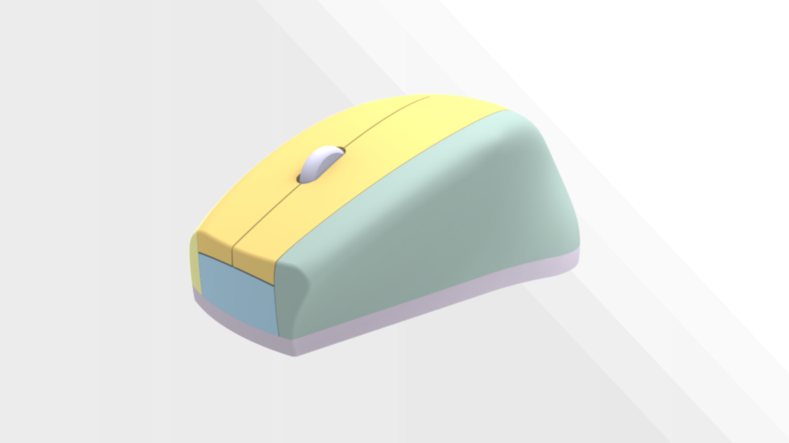
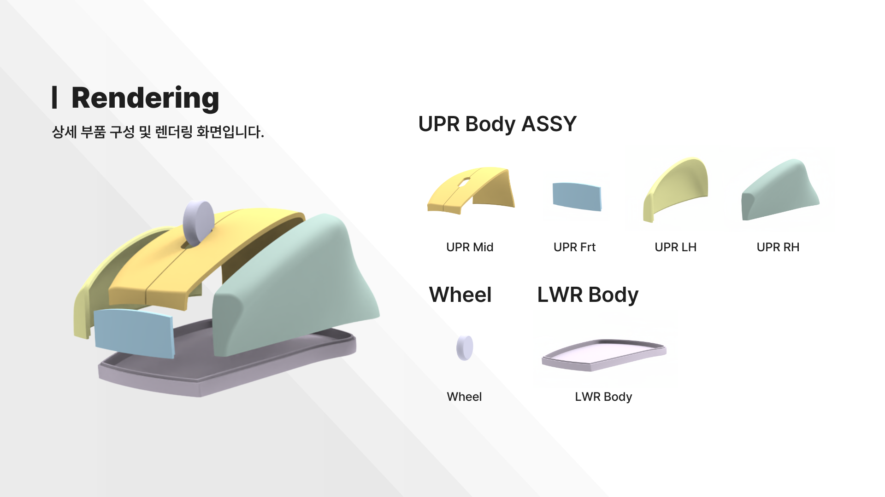
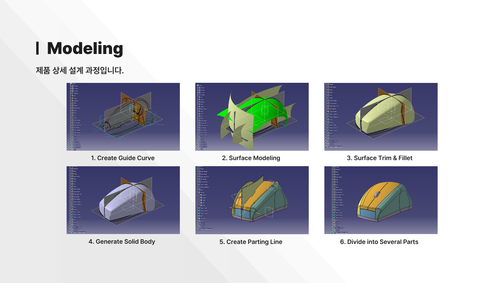
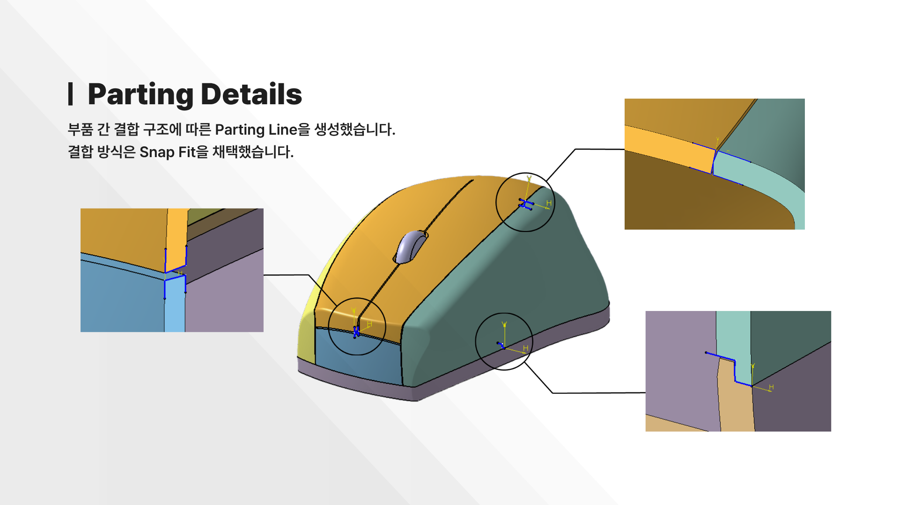
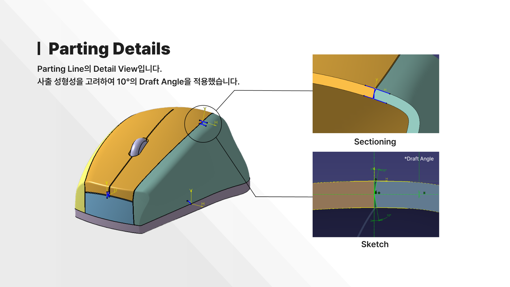

## 📍 Introduction

### Project Introduction
**Mouse** is a product design project developed using CATIA V5. The project uses surface modeling in GSD to build the exterior geometry, starting from reference-based curves and refining the shape by applying Trim and Fillet operations.

The design process converts the final surface into a 1 mm thick solid and applies a parting line to divide the enclosure into multiple components. The project concludes by organizing a structured BOM and family tree to define the assembly hierarchy and manage part relationships.

## 📊 Results

### Mouse COMPL

### Design Process

### Parting Details

## ⚒️ Tools

- **CATIA V5**: 3D modeling, Drafting
- **Keyshot**: Rendering

## 👩🏻‍💻 Author
Eunsori Cho, [@solheeing](https://github.com/solheeing)
